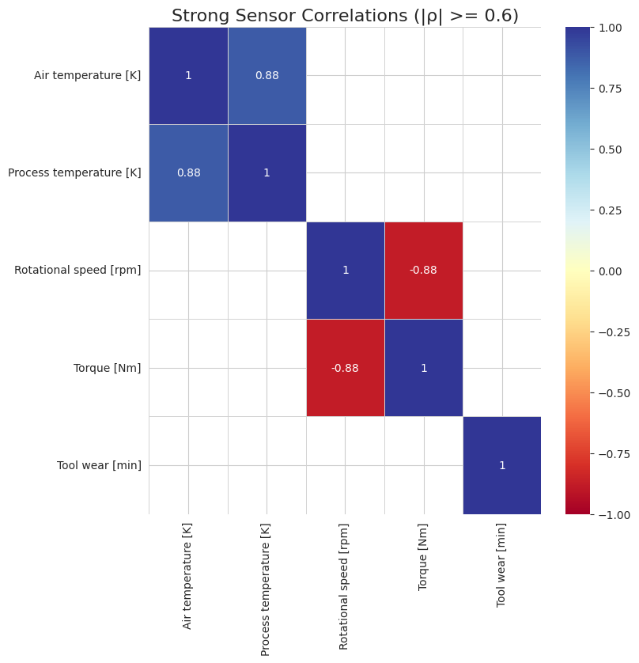
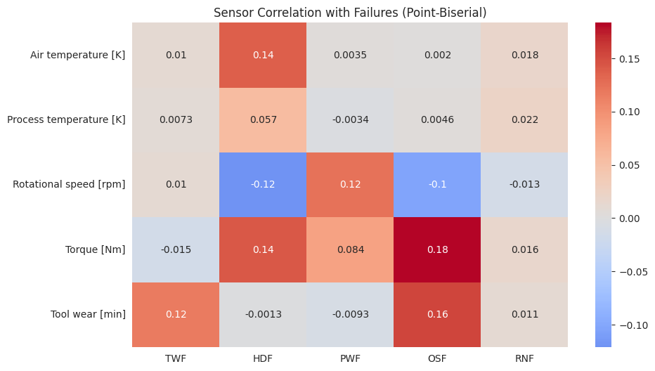
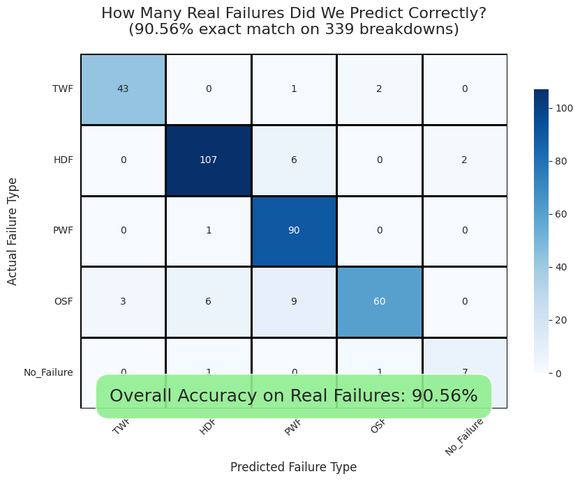

# 🔧 Predictive Maintenance Failure Classification

**Author:** Mahdi Chaaben

## 🎯 Problem & Solution

Industrial milling machines have **5 different failure modes** with distinct physical causes. With only **3% failures** in 10,000 cycles, traditional ML models fail catastrophically by predicting "No Failure" for everything.

**Our Solution:** Physics-driven approach using **4 specialized binary Decision Tree classifiers** → **90.56% accuracy** with **ZERO catastrophic misses**.


## 📊 Dataset: AI4I 2020 Predictive Maintenance

10,000 machine cycles simulating a real CNC milling machine with 5 sensors:
- **Air/Process Temperature [K]**, **Rotational Speed [rpm]**, **Torque [Nm]**, **Tool Wear [min]**

### 5 Failure Modes (339 total failures)

| Mode | Name | Physics-Based Trigger | Count |
|------|------|----------------------|-------|
| **TWF** | Tool Wear Failure | Tool wear > 200 min | 120 |
| **HDF** | Heat Dissipation Failure | High torque + Low speed + High temp | 115 |
| **PWF** | Power Failure | Power outside [3500, 9000] W | 95 |
| **OSF** | Overstrain Failure | High torque × Worn tool | 98 |
| **RNF** | Random Failure | Unpredictable (0.1% chance) | 5 |

## 🔬 Our Solution: Physics-Driven Expert System

### Why Separate Binary Classifiers?

Traditional multi-class models struggle with:
- Extreme class imbalance (97% "No Failure")
- Different physical causes for each failure
- Rare events get ignored

**Our Approach:** One specialized Decision Tree expert per failure mode, each trained only on the sensors that physically cause that failure.

### Feature Engineering by Failure Mode

| Failure | Relevant Sensors | Root Cause |
|---------|-----------------|------------|
| **TWF** | Tool wear only | Pure wear-based threshold |
| **HDF** | Torque, Speed, Air Temp, Process Temp | Thermal runaway (high heat + low cooling) |
| **PWF** | Torque × Rotational Speed | Unsafe power levels |
| **OSF** | Torque, Tool wear, Speed | Mechanical overstrain |

### Key Correlations Discovered

#### Strong Sensor Correlations

*Figure 2: Strong correlations between sensor readings (|ρ| ≥ 0.6)*

#### Sensor-to-Failure Correlations (Point-Biserial)

*Figure 3: Point-biserial correlations reveal which sensors drive each failure mode*

**Key Findings:**
- **TWF:** Tool wear (+0.12) - primary driver
- **HDF:** Torque (+0.14), Air Temp (+0.14), Speed (−0.12)
- **PWF:** Speed (+0.12), Torque (+0.08)
- **OSF:** Torque (+0.18), Tool wear (+0.16)
- **RNF:** All correlations ≈ 0 (truly random, unpredictable)

## 🏗️ Model Architecture

```
Input: Sensor readings
    ↓
┌─────────────────────────────────┐
│  4 Binary Decision Trees        │
│  (max_depth=3, balanced weight) │
├─────────────────────────────────┤
│  • TWF Detector                 │
│  • HDF Detector                 │
│  • PWF Detector                 │
│  • OSF Detector                 │
└─────────────────────────────────┘
    ↓
Probability Fusion Layer
    ↓
P(No_Failure) = 1 - max(P_failures)
    ↓
Winner = argmax(all probabilities)
    ↓
Output: Failure mode + confidence
```

### Prediction Logic

```python
def predict_failure_mode_json(X):
    # 1. Get probabilities from each expert
    probs = {
        "TWF": model_TWF.predict_proba(X)[:, 1],
        "HDF": model_HDF.predict_proba(X)[:, 1],
        "PWF": model_PWF.predict_proba(X)[:, 1],
        "OSF": model_OSF.predict_proba(X)[:, 1]
    }
    
    # 2. Compute No_Failure probability
    max_fail_prob = max(probs.values())
    probs["No_Failure"] = 1 - max_fail_prob
    
    # 3. Select highest confidence prediction
    final_prediction = argmax(probs)
    
    return {
        "probabilities": probs,
        "prediction": final_prediction,
        # 🔧 Predictive Maintenance – Brief

        Approach: four separate shallow **scikit-learn Decision Tree** classifiers (one per failure mode) + simple max-probability fusion.

        Rare machine failures (~3% of 10,000 cycles) are detected by four tiny, physics-aligned **binary Decision Trees** (TWF, HDF, PWF, OSF). Random failures (RNF) are truly unpredictable and excluded.

        ## ✅ Core Result
        **Exact failure type detected:** 307 / 339 (90.56%) real breakdowns  
        **Missed failures:** 0 (none predicted as safe)  
        **Per-mode recall:** TWF 100% · PWF 100% · HDF 91% · OSF 90%

        

